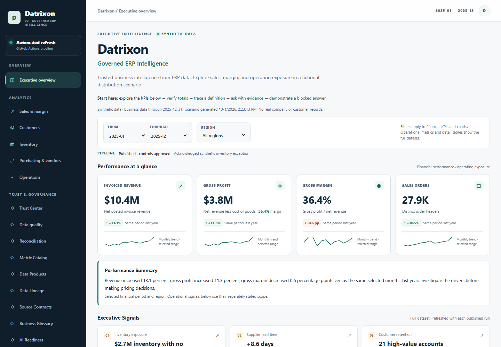
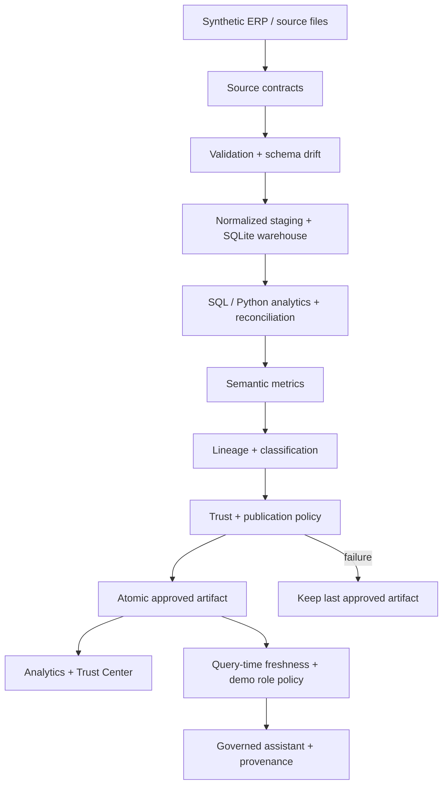
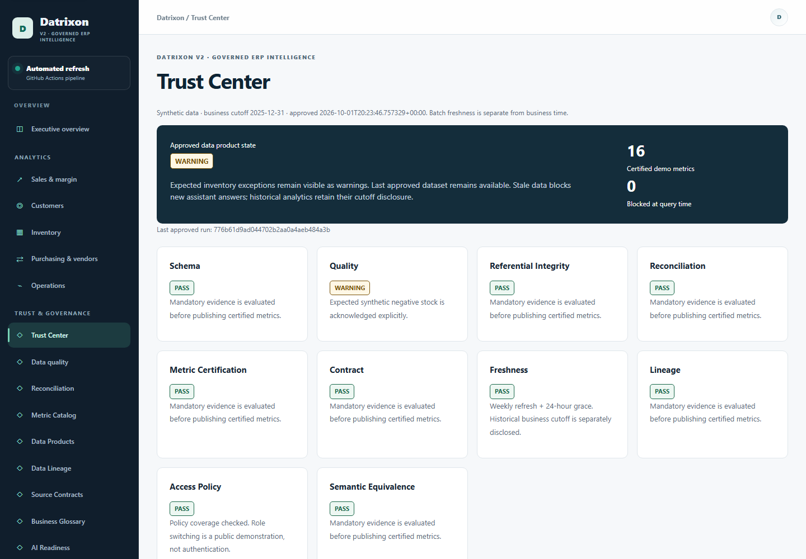
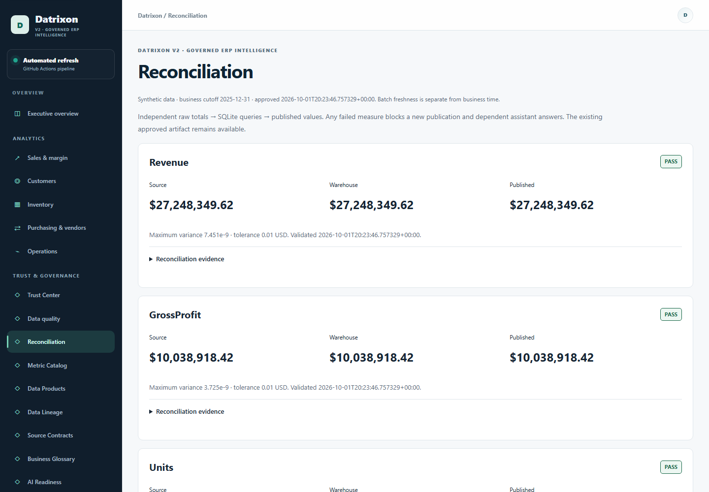
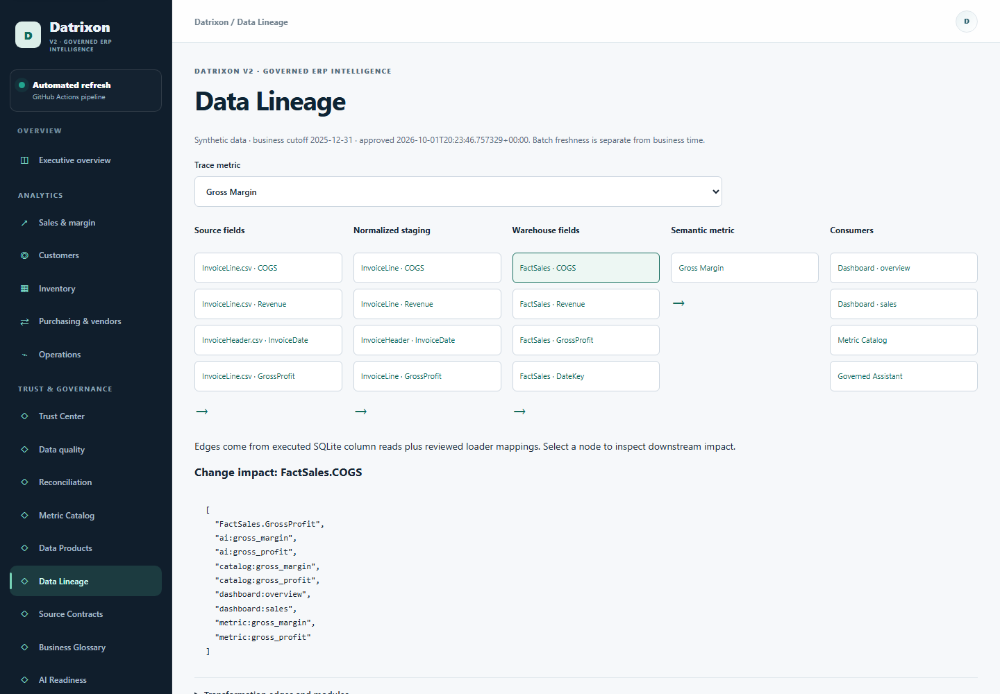
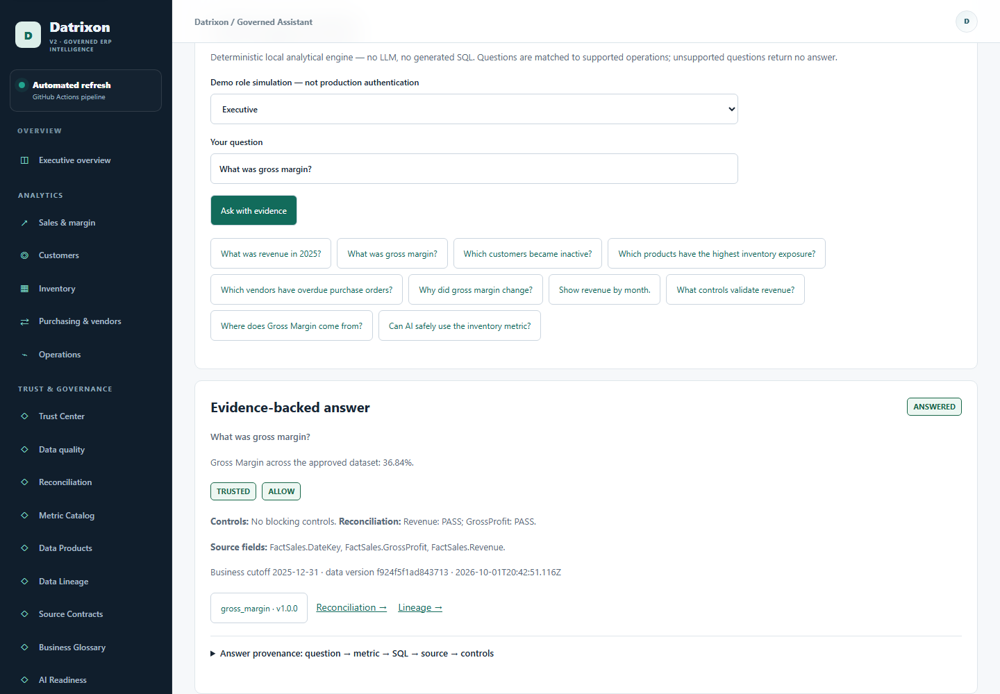

# Datrixon

## Governed ERP Intelligence

Datrixon demonstrates how ERP data becomes trusted analytics and governed analytical answers by validating, reconciling, defining, tracing, and controlling information before publication or use.

**[Live Demo](https://jithendra-data.github.io/datrixon/) · [V2 Release](https://github.com/Jithendra-data/datrixon/releases/tag/v2.0.0) · [Repository](https://github.com/Jithendra-data/datrixon)**

**Python · SQL · SQLite · JavaScript · GitHub Actions · GitHub Pages**

Working synthetic-data demonstration: **19 metric definitions, 16 executable measures, 14 source contracts, 10 trust dimensions.** The assistant is deterministic, not an LLM. No live ERP, production SSO, confidential business data, commercial deployment, or fabricated ROI.

**Source files → contracts & validation → warehouse → reconciliation → governed metrics & lineage → trust & policy → approved analytics and answers.**



## Why Datrixon

A dashboard can load successfully while its totals are wrong. An AI system can repeat a metric whose definition changed, whose source is stale, or whose reconciliation failed. Those failures can misdirect inventory, purchasing, and margin decisions.

Datrixon makes the checks visible. Required control failures prevent a new dataset from replacing the last approved publication. The assistant checks certification, freshness, evidence, and demo access policies before returning an answer. It explains why an answer is withheld instead of inventing a result.

## 60-second demo

Use the existing approved synthetic dataset. Keep the default **Executive** demo role.

1. Open [Executive Overview](https://jithendra-data.github.io/datrixon/#overview) and inspect the KPIs and business cutoff.
2. Open [Reconciliation](https://jithendra-data.github.io/datrixon/#reconciliation): compare source, warehouse, and published totals.
3. Open [Metric Catalog](https://jithendra-data.github.io/datrixon/#metric-catalog). Gross Margin shows its definition, ownership, roles, and controls. Click **Trace this metric** to follow source → staging → warehouse → metric → consumers.
4. Open [Governed Assistant](https://jithendra-data.github.io/datrixon/#ai-assistant), ask **What was gross margin?**, and inspect its evidence and **Answer provenance**.
5. Open [Failure Simulator](https://jithendra-data.github.io/datrixon/#incidents), select **reconciliation**, and click **Introduce failure**. Gross Margin becomes **BLOCKED in this simulation**.
6. Click **Ask the same question in Governed Assistant**, then **Ask with evidence**. The answer is withheld, with the failed control identified.
7. Return to Failure Simulator and click **Restore approved evidence**. Ask again: the approved answer is available.

The simulation follows you between these two views for the current page session. It never changes source files, published data, or the real pipeline. Reload also clears the simulation. A genuinely stale artifact remains blocked after reset; run a validated refresh to recover it. Inventory warnings are expected synthetic exceptions, not hidden failures.

## Implementation status

| IMPLEMENTED | SIMULATED / DEMONSTRATED | FUTURE ENTERPRISE CAPABILITY |
|---|---|---|
| Source contracts, schema drift, normalized staging, SQLite warehouse | Synthetic ERP records and example business owners | Live D365 / ERP integration and source-owner approval |
| SQL semantic metrics, reconciliation, column lineage, impact analysis | Standalone mock change-event adapter | Centralized warehouse, incremental ingestion |
| Trust engine, fail-closed atomic publication, SHA-256 evidence | Browser role switching; no authentication boundary | Entra ID / real SSO, server-side authorization and RLS |
| Deterministic assistant, provenance, local run audit | Isolated failure scenarios and session-only browser audit | Live LLM provider and enterprise audit platform |
| Tests, CI gates, scheduled refresh, Pages deployment | Synthetic scale and control demonstrations | Production SLA, security assessment, measured customer ROI |

**Three definitions remain uncertified:** net sales, average order value, and overall return rate. Existing invoice/return records do not establish the required credit, cancellation, and denominator policies. They cannot be used for answers.

## Architecture



The approved JSON contains analytics **and their matching governance evidence**. The browser never executes user-supplied SQL or downloads the warehouse. Existing Python operational transforms remain alongside SQL measures. [Detailed executing architecture](documentation/architecture/v2.md).

| Modules | Responsibility |
|---|---|
| `python/generators/`, `etl/` | Deterministic source generation, staging, warehouse load, analytics |
| `validation/` | Source controls, independent reconciliation, atomic publication gate |
| `governance/` | Contracts, metric registry, read-only semantics, lineage, trust, policies, audit |
| `web/js/governed-ai.js` | Allowlisted questions, policy checks, evidence-backed answers |
| `web/js/governance.js` | Catalogs, trust evidence, lineage, assistant and demonstration UI |
| `tests/`, `.github/workflows/` | Regression, negative tests, browser checks and deployment gates |

### Design principles

- **Fail closed:** mandatory failures retain the last approved publication and block dependent answers.
- **One governed definition:** material semantic measures are checked against warehouse and dashboard results.
- **Evidence over confidence:** show control outcomes, definitions, lineage, and versions; no opaque score.
- **No fabricated answers:** unsupported questions and unavailable periods receive a refusal.
- **Transparent status:** implemented logic, simulations, and enterprise requirements stay distinguishable.
- **Deterministic reproducibility:** seeds, source hashes, code version, and run evidence identify a build.
- **Governance travels with analytics:** one atomic artifact prevents mixed-version evidence.

## Technical highlights

- Python ETL loads four SQLite facts, six dimensions, purchase receipt events, and an order-service reference table. The separate T-SQL design is not an active SQL Server deployment.
- Fixed source contracts detect breaking schema changes before staging. Five independent totals reconcile raw records, warehouse queries, and published KPIs.
- Executed SQL reads and reviewed loader mappings support column lineage and downstream impact. Policy checks restrict assistant operations to certified, authorized measures.
- Publication manifests retain the exact artifact SHA-256. GitHub Actions verifies code and browser behavior before Pages deployment; failed candidates cannot replace approved data.

## Product evidence

Six consistent desktop captures show the review path; [screenshot notes and mobile view](screenshots/README.md) explain capture conditions.

| Trust Center | Reconciliation |
|---|---|
| [](screenshots/datrixon-v2-trust-center.png) | [](screenshots/datrixon-v2-reconciliation.png) |

| Column lineage | Governed answer |
|---|---|
| [](screenshots/datrixon-v2-lineage.png) | [](screenshots/datrixon-v2-assistant.png) |

[View controlled failure and recovery](screenshots/datrixon-v2-failure.png).

## Run locally

Python 3.12 and Node with pnpm are used for this release. Create and activate a Python virtual environment first.

```bash
python -m pip install -r requirements.txt
pnpm install --frozen-lockfile
pnpm exec playwright install chromium
python -m etl.run_pipeline
python -m http.server 8000 --directory web
```

Open **http://localhost:8000**. The checked-in approved dashboard also works without rebuilding the pipeline.

Use `--skip-generation` to replay raw files, or `--workspace .test-run/example --orders 1000 --purchase-orders 250` for an isolated small build. Defaults: 75,000 order headers, 10,000 purchase orders, 5,000 customers, 2,000 products, four warehouses, and business dates in 2023–2025. Timestamps and runtime measurements change between otherwise deterministic builds.

Configuration: `DATRIXON_RANDOM_SEED` (legacy `NORTHSTAR_RANDOM_SEED` supported) and `DATRIXON_AS_OF_DATE` (default `2025-12-31`). Business cutoff and publication freshness are separate. The assistant checks a 192-hour batch freshness limit; historical analytics remain visible with their cutoff.

## Testing and verification

Release verification: **67 Python tests and 21 JavaScript tests passed**, plus pipeline generation/replay smoke tests, publication/governance validation, and both browser suites. Browser coverage includes **390 / 768 / 1440px**, routes, exports, policy denial, provenance, simulation recovery, keyboard basics and reduced motion. [Recorded results](testing/v2_verification.md).

The stable V2 deployment's JSON matched its local approved manifest byte-for-byte by SHA-256. Credential-pattern scanning found no configured matches; this is not proof against every possible secret. Browser checks are regression evidence, not accessibility or security certification.

```bash
python -m unittest discover -s tests -p 'test_*.py' -v
python -m tests.smoke_pipeline
python -m governance.validate --source data/raw
python -m validation.publication
python -m tests.security_scan
pnpm test
pnpm test:browser
```

Governance validation covers metric definitions, contracts, policy coverage, lineage and approved evidence. `DATRIXON_BASE_URL` targets the live site; `DATRIXON_ALLOW_CDN=1` exercises normal chart loading. Otherwise browser tests verify CDN fallback behavior. `node tests/capture-v2.cjs` refreshes screenshots explicitly.

## Review deeper

- [V2 release notes](documentation/releases/v2.md) and [V1 → V2 architecture](documentation/architecture/v2.md)
- [Metrics and semantic layer](documentation/governance/metrics.md), [contracts](documentation/governance/contracts.md), [trust](documentation/governance/trust.md), [assistant](documentation/governance/assistant.md), [audit](documentation/governance/audit.md)
- [KPI dictionary](documentation/kpi_dictionary/kpi_dictionary.md) and [business methodology](case-study/case_study.md)
- [Conceptual Dynamics 365 mapping](documentation/erp/dynamics365_mapping.md) — no live connector claimed
- [Operations](documentation/operations/pipeline_operations.md), [security boundaries](documentation/governance/security.md), [decisions and limitations](documentation/engineering/decisions.md), [enterprise roadmap](documentation/engineering/enterprise_roadmap.md)

SQLite remains a full-rebuild reference warehouse with REAL monetary values and explicit tolerances. Detail responses disclose extract caps. Browser policy checks cannot protect information already downloaded in public JSON. No general-ledger certification, production SLA, real financial approval, or enterprise-scale performance is claimed.

## Ownership

**Anumala Jithendra** — developed iteratively with AI assistance. Code, tests, and run evidence document the work; no unaided-authorship or commercial-deployment claim is made. [LinkedIn](https://www.linkedin.com/in/anumala-jithendra/) · [Email](mailto:jithendra.anumala1@gmail.com).

[MIT license](LICENSE).
