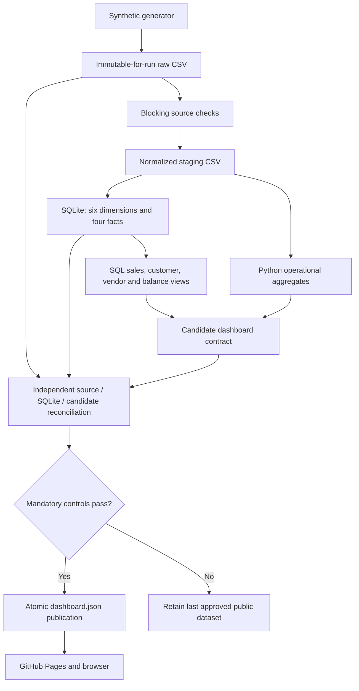

# Executing architecture and reference data model

**V2 extension:** this document describes the preserved V1 pipeline and model. Read [the executing V2 architecture](v2.md) for contracts, semantic governance, trust, lineage, the OrderService reference table and governed analytical answers.

## Implemented deployment

`etl/run_pipeline.py` is the orchestrator. Cleaning trims text and standardizes dates; it does not implement a quarantine service. Invalid source checks stop the run before model loading. `etl/warehouse.py` loads `sql/sqlite/warehouse.sql`, enforces primary/foreign keys, and atomically replaces the reference database. Missing dimension members fail the load; there is no implicit unknown-member substitution.

Monthly sales, customer aggregates, vendor quantities, and inventory balances execute against SQLite views. Inventory velocity, receipt timing, and service calculations use validated staging CSVs with shared business rules. Reconciliation reads original raw sources and independently queries the SQLite facts. No transformation reads staging and then silently switches back to raw for its ordinary analytics path.

## Executed grains

| Table | Grain | References |
|---|---|---|
| FactSales | InvoiceID + LineNumber | Date, Customer, Product, Warehouse, SalesRep |
| FactInventory | InventoryTransactionID | Date, Product, Warehouse |
| FactPurchasing | PONumber + LineNumber | Date, Product, Vendor, Warehouse |
| FactReturns | ReturnID | Date, Customer, Product |

The synthetic returns source has one row per ReturnID; no line number exists. The SQLite implementation uses natural keys and a full-rebuild Type 1 view of master data. Current customer region attribution is not historical territory attribution. DimDate currently covers 2020–2035; dates outside that reference range fail dimension resolution.

## Separate SQL Server design

`sql/01_database` through `sql/08_validation` describe a T-SQL deployment with surrogate-key dimensions. They are not the executing pipeline and do not constitute a tested SQL Server loader. Future work: idempotent loaders, constraints, late/unknown-member policy, effective-dated attributes, DECIMAL monetary storage, and measured query plans.

## Boundaries

The SQLite database is a build artifact, never exposed as a browser database API. The website serves synthetic JSON. GitHub Actions also uploads the synthetic warehouse, manifests and diagnostics as reviewable artifacts; exclusion from Git does not make those artifacts private. No authentication, confidential-data authorization, CDC, or enterprise SLA is claimed. See the [security and scale plan](../engineering/security_and_scale.md) for the private-deployment design.

## Receipt relationship and retained evidence

The four core dimensional facts are supplemented by `PurchaseReceiptEvent`, a child event table keyed by ReceiptID and referencing FactPurchasing(PONumber, LineNumber). It permits multiple partial receipts per purchase line. FactReturns references its original invoice line. FactSales retains status, COGS and discount; inventory retains movement type, source reference and unit cost; purchasing retains ordered, received and remaining quantities and expected date.

Canonical views: MonthlySales, CustomerSales, VendorQuantity, InventoryBalance. Shared operational functions live in etl/operational.py. Shared as-of date and thresholds live in utils/config.py and utils/business_rules.py. Sources beyond the configured cutoff fail validation rather than silently mixing periods.

## Application information architecture

Executive Overview presents the business purpose, reporting interval, four primary financial KPIs, ranked signals, two charts, optional snapshot cards, operating exposure, a trust summary and a compact architecture teaser. Analytics domains use separate hash views. Data Quality contains controls and independent reconciliation. Project & Architecture contains the model, implementation decisions, value assumptions, run evidence and contribution disclosure.

The frontend uses native components, shared visual tokens, restrained GSAP transitions, reduced-motion support, keyboard sorting, responsive tables and a mobile section chooser. Project documentation remains accessible when dashboard data cannot be loaded. Browser regression coverage is maintained in `tests/browser.cjs`.
