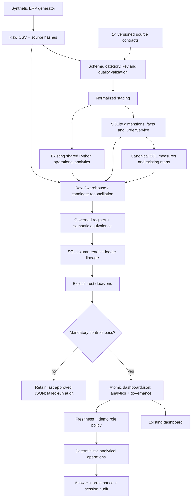

# Datrixon V2 architecture

## Executing implementation

The public artifact is one atomic release unit. It contains the approved analytics and its matching governance evidence, avoiding mixed-version fetches. The SQLite warehouse is still a local/Actions build artifact. No service can execute browser-supplied SQL. V1's independent financial reconciliation remains independent of the semantic implementation.

`OrderService` is an additional reference table at sales-order-header grain. It makes booking counts and shipment measures queryable without misusing invoice counts. Existing facts, dimensions, chart series, investigation extracts, hash routes and lifecycle controls are retained. Natural keys, full rebuilds and SQLite REAL monetary values remain explicit trade-offs.

## Implementation boundary

| Status | Capabilities |
|---|---|
| IMPLEMENTED | Source contracts; SQL metric registry; equivalence; lineage and dependency traversal; deterministic trust; publication blocking; analytical question matching; evidence; versioned local audit; static UI |
| SIMULATED / DEMONSTRATED | Synthetic ERP; named business-owner roles; browser RBAC; copied-decision incident scenarios; standalone change-event adapter |
| FUTURE ENTERPRISE CAPABILITY | Authenticated ERP extracts; Entra ID/OIDC; server-side authorization/RLS; secret storage; immutable audit service; managed warehouse; LLM provider; multi-tenant isolation |

Do not route real confidential data into the public artifact. A production adapter must terminate in restricted landing storage and an authenticated server-side query service. An external LLM may propose an allowlisted operation but cannot become the policy authority or receive raw tables. See [security](../governance/security.md).

## Lineage precision

SQL authorizer callbacks collect actual table/column reads. Reviewed dependency metadata supplements implicit `USING` join keys; every declared column is checked against executing DDL. `warehouse_mapping.json` maps the loader's source fields, including date renames. Validated GP = Revenue − COGS identity edges describe arithmetic dependencies, not another query. Lineage is column-level metadata, not row-level tracing, and does not claim full automatic Python AST analysis.

## Performance

No server, vector database, Docker, Spark or queue was added. Semantic queries run during the build. The browser reuses bounded extracts and precomputed yearly values; no raw warehouse download. Current runtime and artifact bytes belong in the generated manifest, not a hard-coded marketing claim. Browser tests log a local first-evidence-render measurement; it is not a representative p95 network benchmark.
